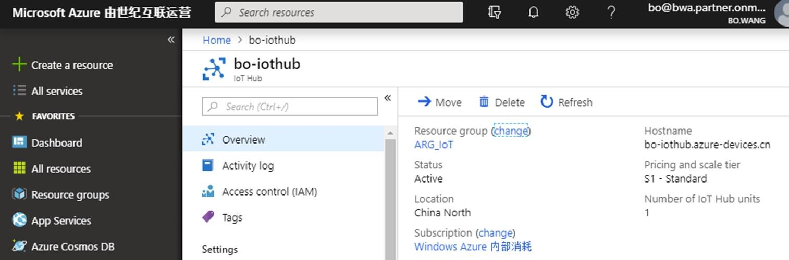
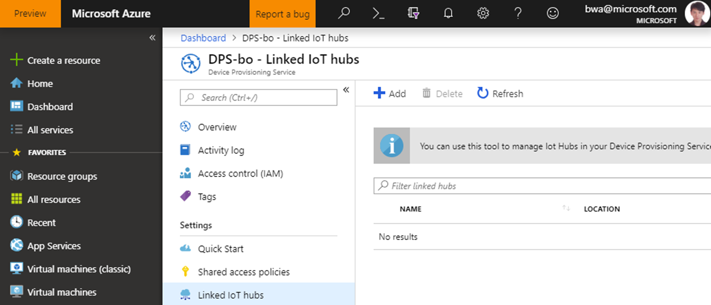
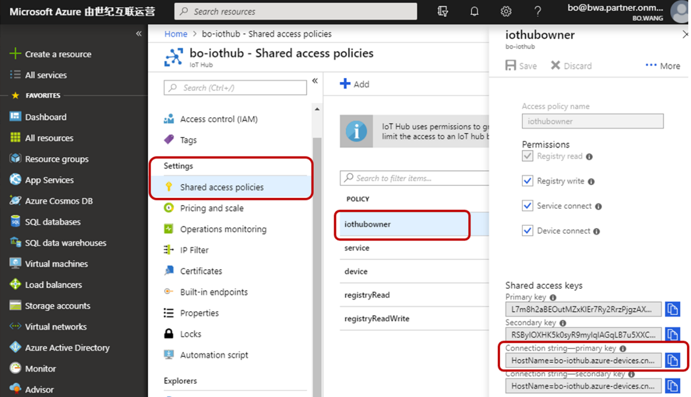
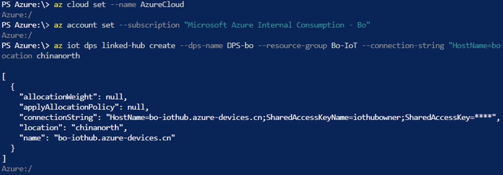
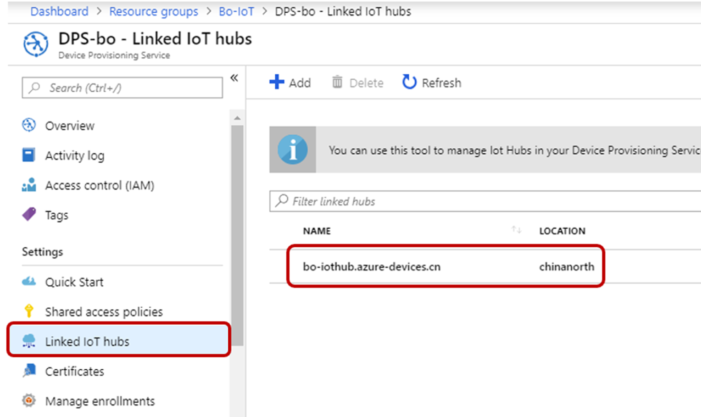
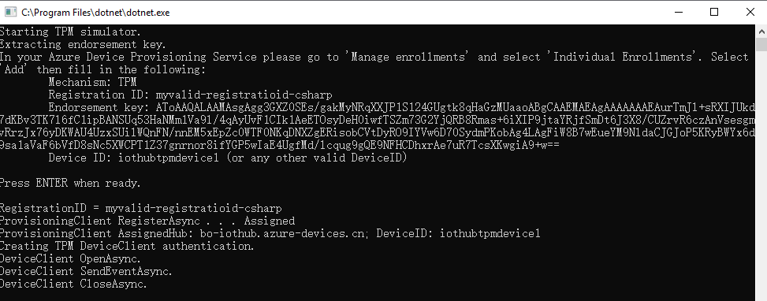
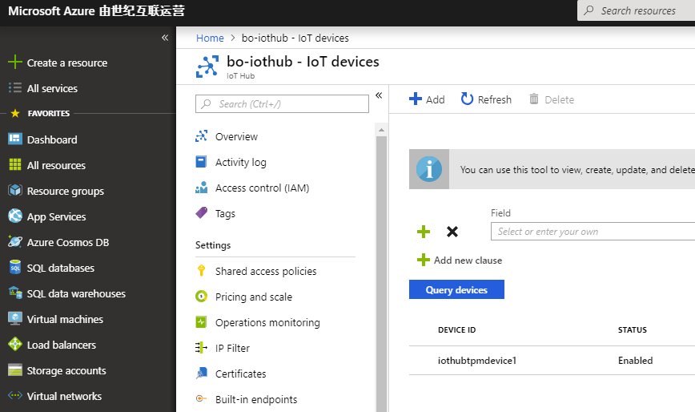

# Using Device Provisioning Service on Azure Global with Azure IoT Hub on Azure China

Author: 
Bo Wang bwa@microsoft.com
Leon Liang leliang@microsoft.com

## Azure IoT Hub Device Provisioning Service Introduction: 
The Azure IoT Hub Device Provisioning Service enables customers to configure zero-touch device provisioning to Azure IoT Hub, and it brings the scalability of the cloud to what was once a laborious one-at-a-time process. The Device Provisioning Process was designed with the challenges of the supply chain in mind, providing the infrastructure needed to provision millions of devices in a secure and scalable manner. Please kindly find more information about Device Provisioning Service and how to provision your device in following link: https://docs.microsoft.com/en-us/azure/iot-dps/about-iot-dps

## Background of this solution: 
Azure IoT Hub Device Provisioning Service is very useful and convenient service to accelerate the provisioning process of IoT devices, especially for connecting hundreds and millions of IoT devices to Azure IoT hub. DPS has been broadly used in many IoT solutions. However, currently, DPS service hasn’t been landed in Azure China Data Center (https://www.azure.cn/ ). That means the development teams are going to use Azure IoT Hub in Azure China DC, they have to implement provisioning service by themselves. Traditionally, in Azure China, the dev team needs to use a VM or Azure function service to implement device registration, authentication, security, token service and return the connection string etc. In addition, dev team also needs to think over the scalability of the service. Obviously, in contrast to DPS, there isn’t small effort. 

In this solution, we’ll use Azure IoT Hub Device Provisioning Service on Azure Global (azure.com) to provision IoT device to connect Azure IoT Hub on Azure China Data Center. Note: please use <a href="https://docs.microsoft.com/en-us/azure/iot-dps/quick-setup-auto-provision-cli" target="_blank"> Azure CLI configure and set up DPS.</a>

## Benefit:
1.	Obviously, if you have built and deployed your solution with DPS and Azure IoT Hub on global Azure, you can easily redeploy your solution to Azure IoT Hub on Azure.cn with very small effort.  
2.	You can keep the security methods you used on your IoT solutions like SAS, X.509 CA etc. 
3.	You don’t need to build your provisioning service
4.	Quickly migrate to DPS on Azure.cn when DPS is landed in Azure.cn
5.	Only provisioning information like connection string will transfer between different regions, the devices and sensors data will be transferred to Azure IoT Hub in Azure China DC.

## How to use global Azure DPS cross region /subscription to provision Azure IoT hub in Azure China

1.	Create an IoT hub in Mooncake. (You can create it by Azure CLI or Portal, no matter which one you preferred). Create an IoT hub with the az iot hub create <a href="https://apac01.safelinks.protection.outlook.com/?url=https%3A%2F%2Fdocs.microsoft.com%2Fen-us%2Fcli%2Fazure%2Fiot%2Fhub%3Fview%3Dazure-cli-latest%23az-iot-hub-create&data=02%7C01%7C%7C371b07afa4584b7d5fdd08d676e7b121%7C72f988bf86f141af91ab2d7cd011db47%7C1%7C0%7C636827134816957572&sdata=qpyfWKbR3bFFnsQjHURjGlSSu5iZo9vRhWf87ZmoBgA%3D&reserved=0" target="_blank"> az iot hub create</a> command.

2.	Create a provisioning service in Global Azure.

    a.  Azure CLI  az iot dps create --name my-sample-dps --resource-group my-sample-resource-group --location westus

    b. Create a provisioning service with the az iot dps create <a href="https://apac01.safelinks.protection.outlook.com/?url=https%3A%2F%2Fdocs.microsoft.com%2Fen-us%2Fcli%2Fazure%2Fiot%2Fdps%3Fview%3Dazure-cli-latest%23az-iot-dps-create&data=02%7C01%7C%7C371b07afa4584b7d5fdd08d676e7b121%7C72f988bf86f141af91ab2d7cd011db47%7C1%7C0%7C636827134816967581&sdata=uGxVcn0xquLMpA5118WMPQHFtHTvKgzbWUAzQtgQtqs%3D&reserved=0" target="_blank"> az iot dps create</a> command.

    

3.	Link the IoT hub and the provisioning service
    
    a.	This step only be done with the **Azure CLI** and cannot be done with Azure portal, the service configuration for **Cross Subscription/Region** cannot be done on Azure portal

    b.	Copy your **Mooncake** IoT Hub **owner** connection string

    
    
    c.	Link the IoT hub and your provisioning service with the <a href="https://apac01.safelinks.protection.outlook.com/?url=https%3A%2F%2Fdocs.microsoft.com%2Fen-us%2Fcli%2Fazure%2Fiot%2Fdps%2Flinked-hub%3Fview%3Dazure-cli-latest%23az-iot-dps-linked-hub-create&data=02%7C01%7C%7C371b07afa4584b7d5fdd08d676e7b121%7C72f988bf86f141af91ab2d7cd011db47%7C1%7C0%7C636827134816967581&sdata=iIq8LbxQD9IBIFz82h%2BrP%2BLqKyyU6IpKM4UJ1ulmR5w%3D&reserved=0" target="_blank"> az iot dps linked-hub</a> create command.

    d.  CLI command:
    > *az iot dps linked-hub create --dps-name DPS-bo --resource-group Bo-IoT --connection-string "HostName=bo-iothub.azure-devices.cn;SharedAccessKeyName=iothubowner;SharedAccessKey=L7m8h2*********" --location chinanorth

    
    
4.	Verify the provisioning service. 
    
    Get the details of your provisioning service with the az iot dps show command.
    

5.	Test your DPS 

    a.	I have finished TPM and X.509 provision process and both of them are running well.

    

    b.	You can also check this device in the Azure portal

    

    

